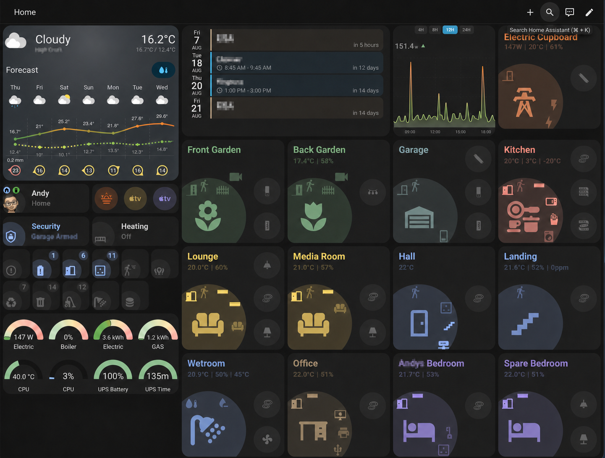

# Home Assistant Orbit Dashboard

A complete Home Assistant dashboard built around [Orbit Cards](https://github.com/andyblac/Orbit-Cards). The supplied YAML is a copy of my own dashboard and is intended as a starting point for your setup.

## Before you start

This is an example dashboard, not a plug-and-play package. It contains entity IDs, device IDs, scripts, calendars, cameras, navigation paths, and theme names from my Home Assistant installation. You will need to replace or remove anything that does not exist in yours.

Personal names, locations, calendar names, user IDs, and device IDs have been removed or replaced with obvious example values in the published copy. Values such as `person.example_user`, `weather.home`, `calendar.example_*`, and `REPLACE_WITH_YOUR_..._DEVICE_ID` must be changed for your installation.

Make a backup of your current dashboard before replacing any raw configuration.

## Requirements

Install [HACS](https://www.hacs.xyz/) if you do not already have it, then install these frontend cards through **HACS > Frontend**:

- [Orbit Cards](https://github.com/andyblac/Orbit-Cards)
- [Weather Forecast Card](https://github.com/troinine/ha-weather-forecast-card)
- [Calendar Card Pro](https://github.com/alexpfau/calendar-card-pro)
- [Gauge Card Pro](https://github.com/benjamin-dcs/gauge-card-pro)
- [Statistics Graph Chart Card](https://github.com/cataseven/Statistics-Graph-Chart-Card)
- [Bubble Card](https://github.com/Clooos/Bubble-Card)
- [Advanced Camera Card](https://github.com/dermotduffy/advanced-camera-card)
- [Auto Entities](https://github.com/thomasloven/lovelace-auto-entities)
- [Mushroom](https://github.com/piitaya/lovelace-mushroom)
- [Device Card](https://github.com/homeassistant-extras/device-card)
- [Card Mod](https://github.com/thomasloven/lovelace-card-mod)

If a card is not listed in the default HACS catalogue, add its GitHub repository as a custom **Dashboard** repository. After installing the cards, refresh the browser or reload the Home Assistant frontend so their resources are registered.

### Required theme

The `AndyBlac-Home` theme is required for the dashboard to use the layout shown in the preview. It includes CSS that modifies Home Assistant's Sections view layout; without it, the section sizes, spacing, and card positions will not appear as intended.

Download `AndyBlac-Home.yaml` from the [`themes/AndyBlac`](https://github.com/andyblac/HA_Dashboard/tree/main/themes/AndyBlac), install it in your Home Assistant themes directory, reload themes, and leave `theme: AndyBlac-Home` set in the dashboard YAML.

The configuration also references `Custom Thermostat Theme` for thermostat cards. Install that theme if you use those cards, or adjust their individual theme settings for your setup.

## Installation

1. Download [`orbit-dashboard.yaml`](orbit-dashboard.yaml), or copy its contents from this repository.
2. In Home Assistant, create a new empty dashboard under **Settings > Dashboards**. Set its URL to `dashboard-main`; the supplied room-navigation paths expect this URL. Using a separate dashboard avoids overwriting your current one.
3. Open the new dashboard, select the three-dot menu, and choose **Edit dashboard**.
4. Open the three-dot menu again, choose **Raw configuration editor**, and replace its contents with the contents of `orbit-dashboard.yaml`.
5. Save the dashboard. Missing cards or entities are expected until the next section is complete.

You need an administrator account to access the raw configuration editor. This file is the contents of a dashboard, so do not place it directly in `configuration.yaml`.

## Make it yours

Open `orbit-dashboard.yaml` in a text editor and replace my entity IDs with your own. Home Assistant's **Developer Tools > States** page is useful for finding the correct IDs.

At a minimum, review:

- Every `entity:`, `main_entity:`, `tracker_entity:`, and `battery_entity_*` value
- Camera, calendar, weather, person, media player, climate, and device references
- Scripts, scenes, helpers, and template sensors used by the status and action cards
- The `REPLACE_WITH_YOUR_FREEZER_DEVICE_ID` and `REPLACE_WITH_YOUR_REFRIGERATOR_DEVICE_ID` placeholders, plus any service/action targets
- Dashboard `navigation_path:` values
- The required `AndyBlac-Home` dashboard theme and any per-card theme settings, such as `Custom Thermostat Theme`

You can remove cards or entire sections that you do not need. Work through the dashboard one section at a time; Home Assistant will show unavailable entity errors for references that have not yet been changed.

Some of the template sensors, scripts, and other supporting configuration used by this example are available in my [`HA_config_files` repository](https://github.com/andyblac/HA_config_files). Copy only the parts you understand and need, then adapt their entities for your installation.

## Navigation paths

Internal room links use `/dashboard-main/<room>`, which is why the installation steps specify `dashboard-main` as the dashboard URL. If you choose a different URL, replace every `/dashboard-main/` occurrence in the YAML.

The configuration also contains these links to dashboards outside this repository:

- `/dashboard-energy` — Home Assistant's Energy dashboard
- `/power-usage/0`, `/power-usage/1`, and `/power-usage/2` — a separate power-usage dashboard from my installation

Remove or change external paths that do not exist in your Home Assistant instance. Links beginning with `#`, such as `#security`, open Bubble Card pop-ups included in this dashboard and should be left unchanged.

## Display and compatibility

The preview shows the dashboard on a wide landscape display. `AndyBlac-Home` controls the intended Sections view sizing and spacing, but the exact arrangement can still vary with screen size, browser zoom, Home Assistant frontend version, and custom-card versions.

This dashboard uses Home Assistant's Sections view and current frontend card options. If you publish an issue, include your Home Assistant version, browser or Companion App version, screen size, and the versions of the affected custom cards.

## Updating

Treat `orbit-dashboard.yaml` as an example rather than an automatic update. Replacing your configured dashboard with a newer copy will overwrite your entity IDs and other customizations. Back up your working dashboard and compare changes before applying an update.

## Troubleshooting

- **Custom element doesn't exist:** install the matching card from the requirements list, then hard-refresh the browser.
- **Entity not available:** replace the example entity ID with one from your Home Assistant instance.
- **Blank camera or chart:** confirm that the referenced camera or sensor exists and supplies the data expected by that card.
- **Room links open a 404 page:** set the dashboard URL to `dashboard-main` or update the `/dashboard-main/` navigation paths.
- **Freezer or refrigerator Device Card fails:** replace its `REPLACE_WITH_YOUR_..._DEVICE_ID` placeholder with the device ID from your Home Assistant instance, or remove that card.
- **Layout, spacing, or card positions look different:** make sure `AndyBlac-Home.yaml` is installed, reload your themes, and confirm the dashboard still contains `theme: AndyBlac-Home`. Screen size and Home Assistant frontend versions can also affect the layout.

## Files

- [`orbit-dashboard.yaml`](orbit-dashboard.yaml) — complete raw dashboard configuration
- [`Preview.png`](Preview.png) — dashboard preview

## Licence

See [`LICENSE`](LICENSE).
